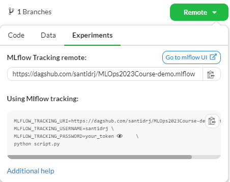

# Synopsis

An AI-powered news summarization tool that extracts content from article URLs.

## Project Setup
Here's a guide on how to setup the project locally on your machine in order to contribute to the project.


### 1. Clone the repo to your local machine using
```
git clone https://github.com/taed2-2526q1-gced-upc/TAED2_Synopsis.git
```

### 2. Install the prerequisites & packages
```
python3 -m pip install --user pipx
python3 -m pipx ensurepath
pipx install uv
uv sync
```

### 3. Fill the .env
Get the following information at the [DagsHub repo](https://dagshub.com/bielupc/TAED2_Synopsis) and fill the `.env` file.



```
cp .env.template .env
```
```
MLFLOW_TRACKING_URI=https://dagshub.com/bielupc/TAED2_Synopsis.mlflow
MLFLOW_TRACKING_USERNAME=<DagsHub-user-name>
MLFLOW_TRACKING_PASSWORD=<DagsHub-password-token>
```

### 4. Get the data and run the pipeline
```
dvc pull
dvc repro
```

## Version Control Guidelines
To ensure a clean and collaborative workflow, follow these rules when contributing to the project:

### Branching Strategy
For each new **feature**, create a dedicated branch:
 ```bash
  git checkout -b feature
```

**Do not** work directly on `main`.

### Pull Requests

* To integrate changes into `main`, always open a **Pull Request (PR)**.
* Wait for the **whole team to review and approve** the PR before merging.
* **Never** merge unverified PRs or push directly to `main`.

### Commit Messages

Commit messages must:
  * Be written in **present tense**.
  * Start with a **capitalized verb** (e.g., *Add*, *Fix*, *Update*).
  * Be short and descriptive.

Examples:

- Add preprocessing step for missing values
- Fix bug in data loader
- Update README with setup instructions

### Data Tracking with DVC

Track the `data` folder using DVC:

  ```bash
  dvc add data
  ```
When data changes, make sure to push both:

 * **Data to DagsHub**:

    ```bash
    dvc push
    ```
 * **Code to GitHub**:

    ```bash
    git push origin feature
    ```

### General rules
Periodically **sync your branch with `main`** to avoid large conflicts:
  ```bash
  git fetch origin
  git rebase origin/main
````


Always **pull changes from your branch** regularly to stay aligned with remote updates.
```
git pull
```
**Never force push** (`git push --force`) into your branch, as this can overwrite teammates’ work. Use a normal push.

## Project Organization

```
├── LICENSE            <- Open-source license if one is chosen
├── Makefile           <- Makefile with convenience commands like `make data` or `make train`
├── README.md          <- The top-level README for developers using this project.
├── data
│   ├── external       <- Data from third party sources.
│   ├── interim        <- Intermediate data that has been transformed.
│   ├── processed      <- The final, canonical data sets for modeling.
│   └── raw            <- The original, immutable data dump.
│
├── docs               <- A default mkdocs project; see www.mkdocs.org for details
│
├── models             <- Trained and serialized models, model predictions, or model summaries
│
├── notebooks          <- Jupyter notebooks. Naming convention is a number (for ordering),
│                         the creator's initials, and a short `-` delimited description, e.g.
│                         `1.0-jqp-initial-data-exploration`.
│
├── pyproject.toml     <- Project configuration file with package metadata for 
│                         src and configuration for tools like black
│
├── references         <- Data dictionaries, manuals, and all other explanatory materials.
│
├── reports            <- Generated analysis as HTML, PDF, LaTeX, etc.
│   └── figures        <- Generated graphics and figures to be used in reporting
│
├── requirements.txt   <- The requirements file for reproducing the analysis environment, e.g.
│                         generated with `pip freeze > requirements.txt`
│
├── setup.cfg          <- Configuration file for flake8
│
└── src   <- Source code for use in this project.
    │
    ├── __init__.py             <- Makes src a Python module
    │
    ├── config.py               <- Store useful variables and configuration
    │
    ├── dataset.py              <- Scripts to download or generate data
    │
    ├── features.py             <- Code to create features for modeling
    │
    ├── modeling                
    │   ├── __init__.py 
    │   ├── predict.py          <- Code to run model inference with trained models          
    │   └── train.py            <- Code to train models
    │
    └── plots.py                <- Code to create visualizations
```

--------

